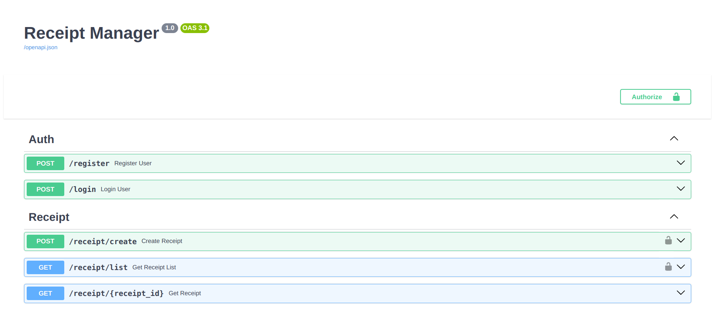
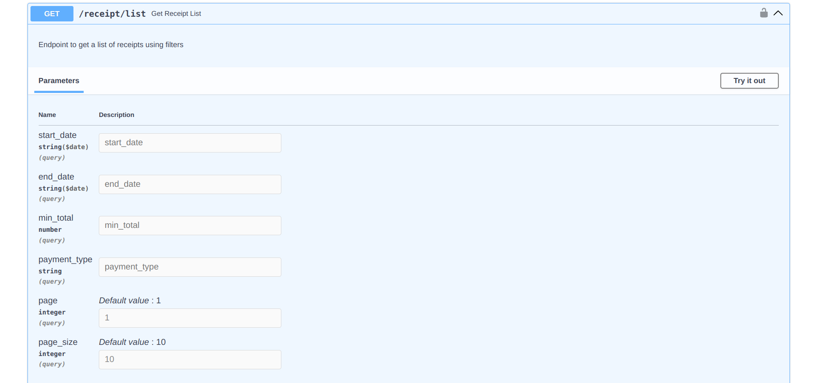
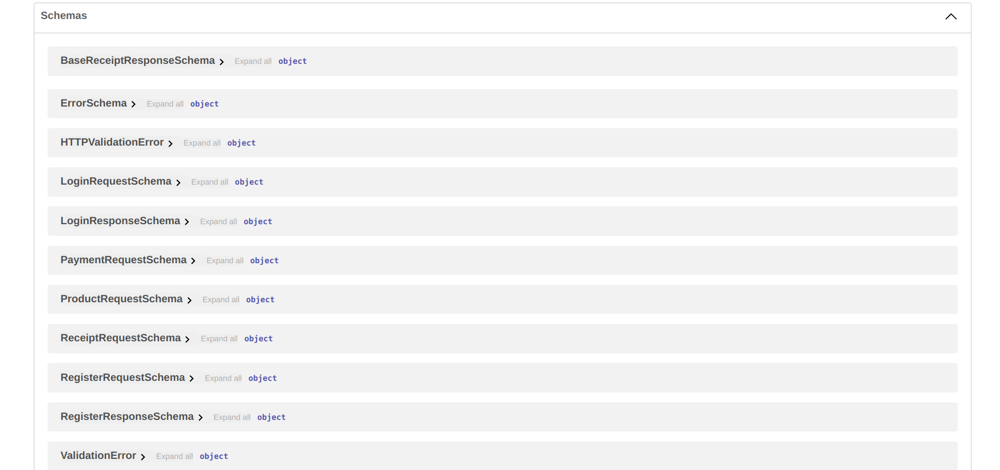
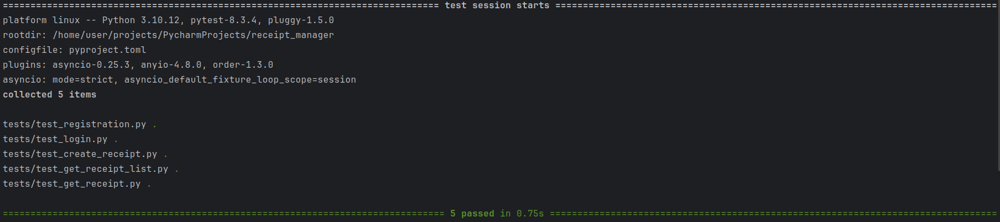
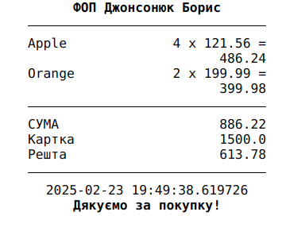

# Receipt Manager API

This project allows you to manage receipts, create them, view them, and calculate additional values.

---

## How to Run the API
To start, use the following commands:

Run test:
> make run-test

Run API using uvicorn:
> make run-dev

Run API using gunicorn:
> make run-prod

---

## Description
### Documentation
The documentation is available at the path `/docs.` 

Use `ADMIN_USER` and `ADMIN_PASS` for login, which should be located in `settings/.env`. There, you will find detailed information about each route:

As well as the ability to view validation schemas:

---

### Testing
The tests include 5 stages that verify the core functionality of the API.

---

### Work with API, step by step 
#### Private API

First, you need to register a user at `/register`, then log in at `/login`, where you will receive a JWT token. This token must be used to access protected endpoints by including it in the headers.
> curl -H "Authorization: Bearer {JWT_TOKEN}"

---

#### Public API

You can obtain a printed receipt by knowing its ID, and additional parameters allow you to adjust the number of characters per line.

---
